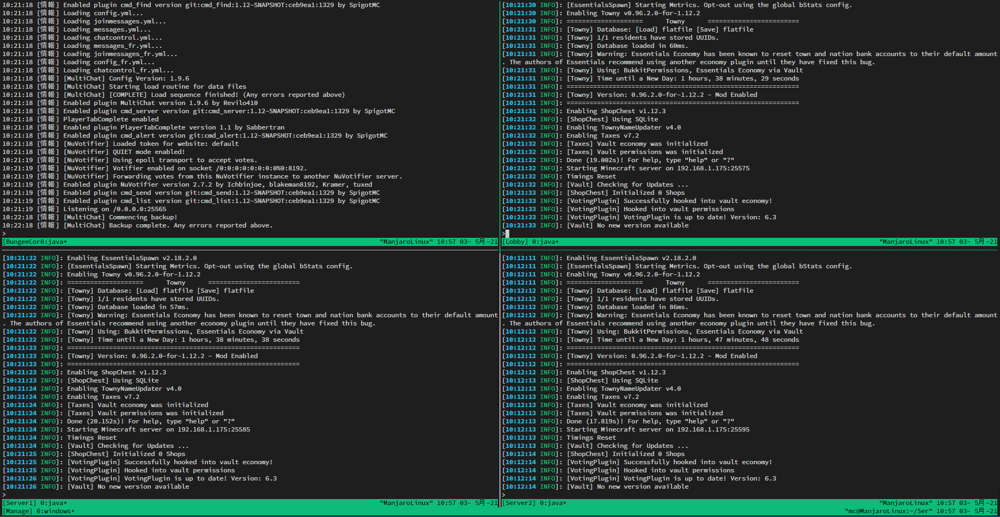

# minecraft_tmux

## What's this?
* Something to ease the administration of minecraft servers using tmux.
1. Feel free to edit and use it as you like.
2. Feel free to modify it, but I'd appreciate it if you'd fork it :)
3. If you have any problems or want to improve it, send meissues!

## Recommend app
* [tmux](https://wiki.archlinux.org/title/tmux) - All used
* [tmuxp](https://wiki.archlinux.org/title/tmuxp) - Use Manage.yaml

### Service.sh
#### Settings
* Set the variables in each file and start it up.
* **Also note that the names of the sockets must be the same!**

#### Commands
* `./Service.sh start` - Starting server in tmux session.
* `./Service.sh stop` - Stopping server in tmux session at 60s.
* `./Service.sh restart` - Stop & Start server in tmux session at 60s.
* `./Service.sh reload` - Reload tmux.
* `./Service.sh attach` - Attach server in tmux session.

### BungeeCord.sh
* `./BungeeCord.sh start` - Starting BungeeCord in tmux session.
* `./BungeeCord.sh stop` - Stopping BungeeCord in tmux session at 60s.
* `./BungeeCord.sh restart` - Stop & Start BungeeCord in tmux session at 60s.
* `./BungeeCord.sh reload` - Reload tmux.
* `./BungeeCord.sh attach` - Attach BungeeCord in tmux session.

### Manage.yaml
* `tmuxp load ./Manage.yaml`
